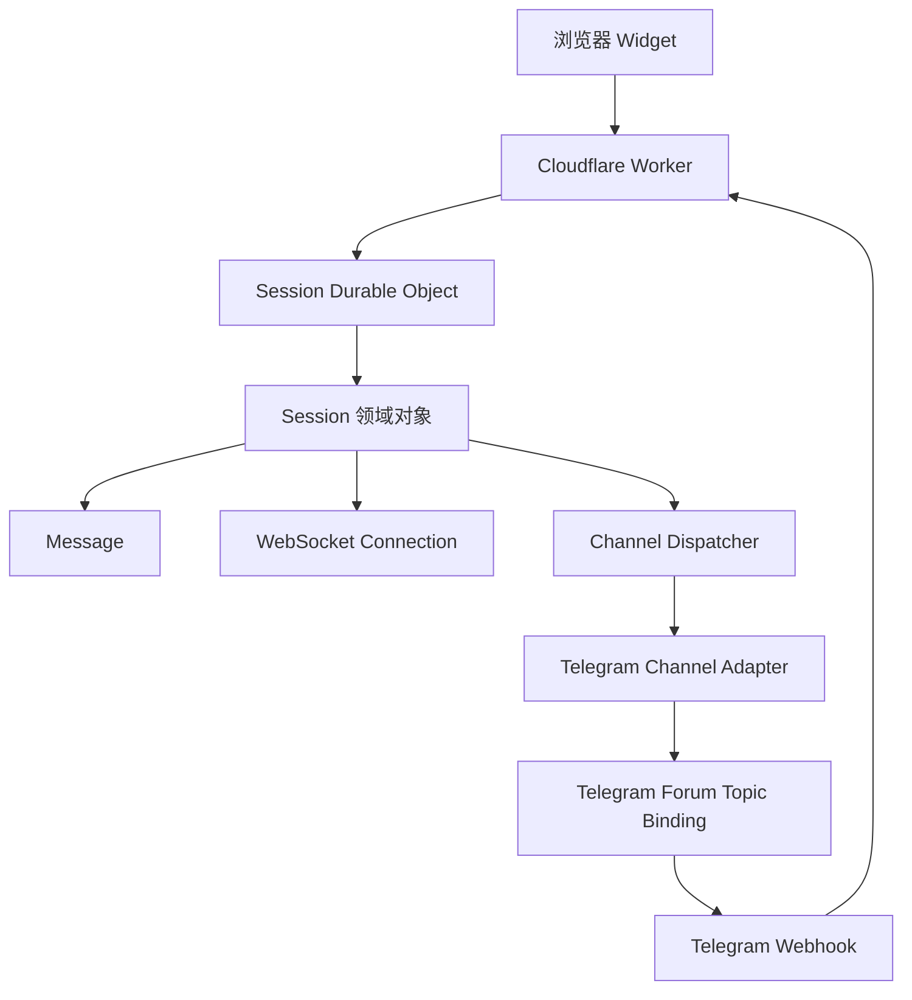
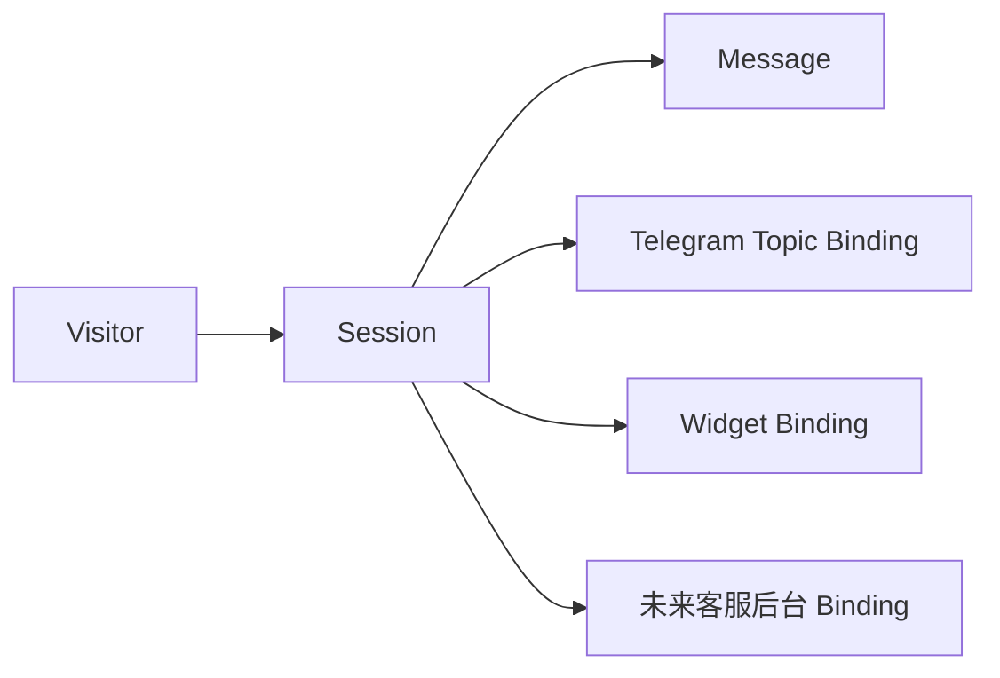
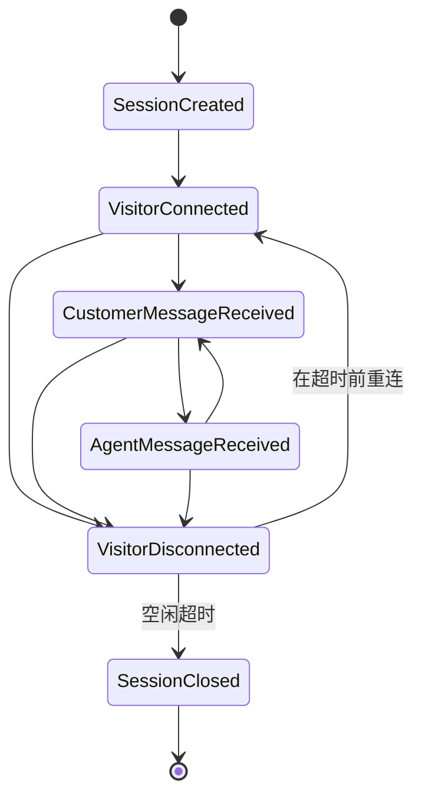
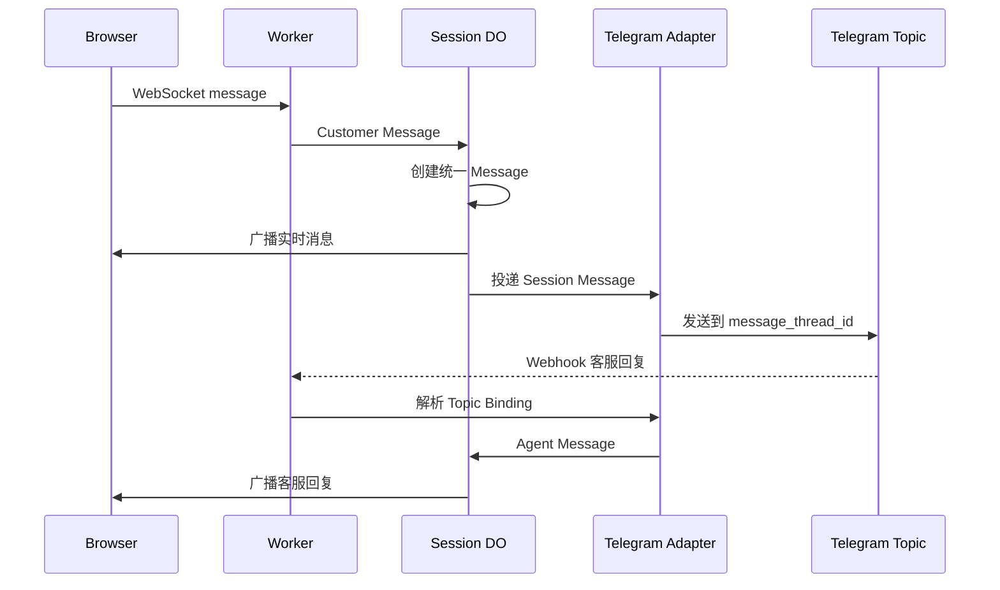
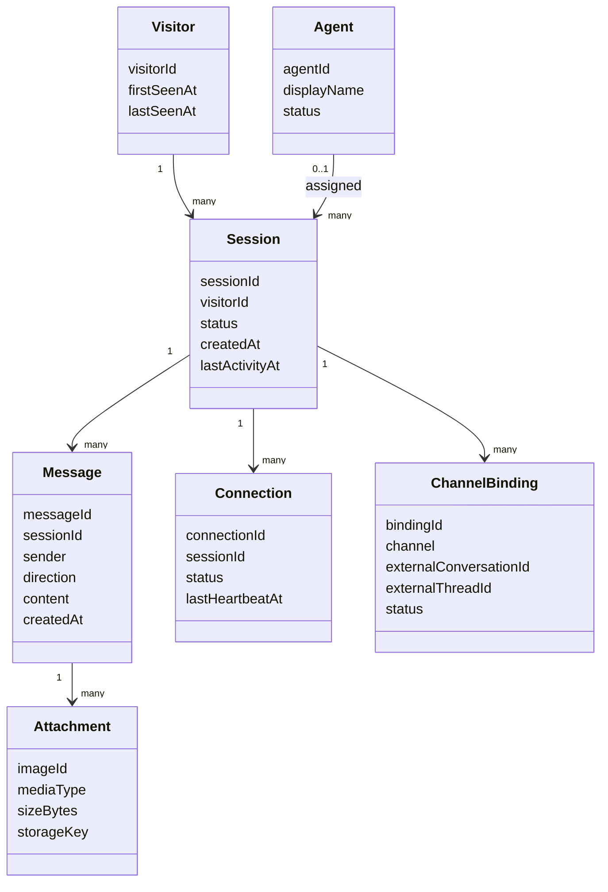

# Session 中心架构

本文档定义 live-support 的领域边界和实时会话架构。项目当前面向 Cloudflare 部署，提供浏览器 Widget 与 Telegram 客服渠道；Telegram、WebSocket、Durable Object、KV 和 R2 都属于基础设施，不是业务核心。

## 1. 项目定位

live-support 是一套以 `Session` 为核心的在线客服系统。访客、会话和消息属于业务领域；Telegram Topic 只是把一个 Session 展示给客服的一种 Binding。

未来增加网页客服后台、多客服或 AI 时，应增加新的应用服务和渠道适配器，而不是把业务逻辑复制到 Telegram 或 Widget 中。

## 2. 整体架构



### 设计原则

- 所有业务操作以 Session 为入口。
- Message 不包含 Telegram 专属格式。
- Telegram Topic 只保存为 Session 的外部渠道绑定。
- Connection 只表示一个实时浏览器连接。
- Durable Object 负责实时协调和短期 Session 状态，不负责永久聊天历史。
- KV 用于配置和缓存，不作为复杂业务对象的唯一权威存储。
- R2 只负责图片对象，不负责消息和会话状态。

## 3. 为什么采用 Session First

如果把 Telegram Topic 当作会话核心，未来接入 Discord、LINE 或网页客服后台时，业务层会被 Telegram 的 Chat ID、Thread ID 和消息格式绑定。

以 Session 为核心后，系统只需要维护一份业务会话：



每个渠道只负责把外部消息转换为统一 Message，再把 Session Message 转换为渠道格式。

## 4. 领域对象

### Visitor

Visitor 表示匿名或已识别的访客身份，包含 `visitor_id`、首次访问时间和最近活动时间。

Visitor 可以拥有多个 Session。Visitor ID 是身份标识，不代表永久用户账号。

### Session

Session 表示一次客服会话，是系统唯一核心对象。它包含：

- `session_id`
- `visitor_id`
- 会话状态
- 创建时间和最近活动时间
- 渠道绑定
- 客服分配信息（未来）
- 标签和策略状态（未来）

刷新或重连时，只要 Visitor Token 和 Session 仍然有效，就恢复原 Session。

### Message

Message 表示 Session 中的一条业务消息，与 Telegram 或 WebSocket 无关。

消息可以来自：

- 访客
- 客服
- 系统
- 自动回复
- AI（未来）

Message Repository 只定义读取和保存边界，当前并不强制启用数据库。

### Attachment

Attachment 只描述图片或其它附件的元数据，例如：

- `image_id`
- MIME 类型
- 文件大小
- 存储引用
- 访问 URL

上传、校验、R2 Put 和 URL 生成属于基础设施服务，不属于 Attachment 对象。

### Connection

Connection 只表示一条实时浏览器连接，包含：

- 连接 ID
- 所属 Session
- 建立时间
- 最后心跳时间
- 连接状态
- 传输类型

Connection 不是 Visitor，也不是客服身份，更不是业务 Session。连接断开时，Session 可以继续存在并等待重连。

## 5. Session 生命周期



### 创建

首次有效连接时创建 Session，并注册第一个 Connection。Telegram Topic 等渠道绑定可以在 Session 创建后异步建立。

### 恢复

浏览器刷新、网络中断或 WebSocket 重连时：

1. 验证 Visitor Token。
2. 查找仍然有效的 Session。
3. 注册新的 Connection。
4. 复用原有渠道 Binding。

### 结束

推荐默认空闲超时为 24 小时。浏览器关闭不应立即结束 Session，因为关闭事件不可靠；断开只移除 Connection，最终由空闲超时关闭 Session。

如果未来增加“结束会话”按钮，可以显式跳过等待并关闭 Session。

## 6. Session Event

项目提供统一的 Session Event 类型，不引入 Event Bus，也不执行额外异步分发。

当前事件包括：

- `SessionCreated`
- `VisitorConnected`
- `VisitorDisconnected`
- `CustomerMessageReceived`
- `AgentMessageReceived`
- `AttachmentUploaded`
- `TopicCreated`
- `TopicClosed`
- `SessionClosed`

事件类型的用途是为未来日志、统计、AI 和通知提供统一数据结构。当前代码可以继续直接调用现有服务，不要求所有事件立即发布。

## 7. Telegram Topic Binding

Telegram Topic 的生命周期从属于 Session：

1. Session 首次建立时创建 Topic。
2. 后续消息继续发送到同一个 Topic。
3. 浏览器刷新或重连不会创建新 Topic。
4. Session 结束时关闭 Topic。
5. Topic 被删除或失效时，标记 Binding 无效并创建替代 Topic。

Topic 名称默认使用网站和访客标识：

```text
商城A｜visitor-1234
```

如果存在访客昵称，则使用 `商城A｜访客昵称`。名称只用于客服识别，不包含手机号、IP、User-Agent 或其它隐私信息。

### 首条消息

Topic 创建后发送一次完整访客信息，包括网站、地区、时区、语言、设备、浏览器和连接时间。

后续消息只发送聊天内容，例如：

```text
用户：你好
```

客服需要资料时，可在当前 Topic 使用 `/info` 查询当前 Session 的资料。

## 8. Durable Object 职责

ChatRoom Durable Object 负责：

- 一个 Session 的实时协调；
- WebSocket 连接注册和清理；
- 心跳和超时处理；
- 实时消息广播；
- Session 短期状态和渠道绑定；
- 会话结束 Alarm。

ChatRoom 不负责：

- 永久聊天历史；
- 全局统计；
- 报表和业务分析；
- Telegram 专属业务规则；
- 未来客服后台页面。

Durable Object Storage 可以保存恢复 Session 所需的最小状态，但不应被当作永久 Message Repository。

## 9. KV 与 R2

### KV

KV 适合保存：

- 自动回复配置；
- 部署配置；
- Topic 反向索引缓存；
- 低频读取配置。

关键 Session 状态应以 Durable Object Storage 为权威来源，不能只依赖 KV 的最终一致性。

当前实现将 Topic 反向索引写入 `CHAT_CONFIG` KV，同时在 ChatRoom 的会话元数据中保留渠道绑定。KV 是 Webhook 查询的快速索引，不应被视为 Session 的替代存储。未来如果需要更强的反向路由一致性，可以增加按管理员 Chat ID 分片的 Router Durable Object；本次不引入该额外组件。

### R2

R2 负责：

- 图片对象存储；
- 图片对象读取；
- 附件生命周期管理。

R2 不保存 Session 业务状态，也不承担消息路由和聊天历史查询。

## 10. 消息和客服回复数据流



无法确认 Topic 映射时，必须拒绝路由，不能猜测访客或广播给其它 Session。

## 11. Message Repository

项目只提前定义 `MessageRepository` 接口：

- 保存 Message；
- 按 Session 和 Message ID 查询；
- 按 Session 分页读取。

当前 ChatRoom 继续负责实时传输，不强制写入 D1，也不改变现有 WebSocket 协议。

未来接入 D1、Durable Object SQLite 或历史消息存储时，只需新增 Repository 实现，Session 应用服务不需要改为依赖具体数据库。

## 12. 未来扩展

### 网页客服后台

增加 Web 管理渠道 Adapter，仍通过 Session 和 Message 访问会话，不读取 Telegram 内部结构。

### 多客服

在 Session 上增加客服分配、团队和观察者关系。Telegram Topic 可以保持不变，业务层只更新 Assignment。

### AI 自动回复

AI 作为独立的回复策略或渠道 Adapter，读取 Session Context 并生成 Agent/Bot Message，不直接操作 WebSocket 或 Telegram API。

### 更多通知方式

Discord、LINE、WhatsApp、邮件和 Push 都实现独立 Channel Adapter。业务层只处理统一 Message 和 Session Event。

## 13. 领域模型图



## 14. 边界总结

业务核心是：

```text
Visitor → Session → Message
```

基础设施是：

```text
Worker、WebSocket、Durable Object、KV、R2、Telegram
```

    只要保持这个边界，Telegram 可以被替换，Widget 可以增加后台版本，消息可以接入历史存储，系统仍然不需要重写 Session 业务层。

## 15. 异常恢复（Failure Recovery）

### Topic 创建失败

`createForumTopic` 的 403、429、5xx 或无效响应只会使当前管理员频道暂时没有 Topic，不会使 Session 失效。ChatRoom 保留访客的会话状态，并在访客仍在线时通过 Durable Object alarm 每 30 秒重试。部分管理员频道成功时，已成功的 Topic 立即可用，失败频道独立重试。

### Topic 被删除或失效

发送到 Topic 返回线程不存在或其它明确的无效线程错误时，TelegramService 会为同一 `sessionId` 创建替代 Topic，写入新的 `chat_id + message_thread_id` 反向索引，发送恢复通知，然后重发当前消息。ChatRoom 收到新的 Topic 列表后更新 Durable Object 状态。恢复失败只记录错误并保留访客连接，不会猜测其它 Session。

### Worker 或 Durable Object 重启

Session 的 Topic 列表和稳定 `sessionId` 存在 Durable Object storage；KV 保存 `chat_id + message_thread_id -> sessionId` 反向索引，并保存 `sessionId -> visitorId` 的解析索引。DO 恢复时会迁移旧格式索引并重新写入会话绑定，因此 Worker 重启不会依赖内存或消息顺序。没有有效绑定的 Telegram 回复会被安全忽略。

### Session Timeout

超过 `SESSION_IDLE_TIMEOUT` 后，旧 Topic 只发送结束通知并关闭，不删除历史消息；旧 Session 状态从 DO storage 清除。下一次访问生成新的稳定 `sessionId` 和新的 Topic，旧 Topic 的回复不会路由到新 Session。

### 多标签页与断线重连

同一 Visitor 的浏览器标签页继续使用同一个 Visitor Token，SessionManager 会复用活跃 Session；因此多个标签页和 WebSocket 重连不会创建重复 Topic。旧连接只负责传输状态，Topic 绑定始终由 Session 决定。

### 安全边界

所有 Telegram 回复先按 `chat_id + message_thread_id` 查询 Session 绑定，再验证当前 DO 中的 `sessionId` 是否仍然有效。映射缺失、会话已超时或访客已离线时返回安全的已读确认，不向其它访客转发。
